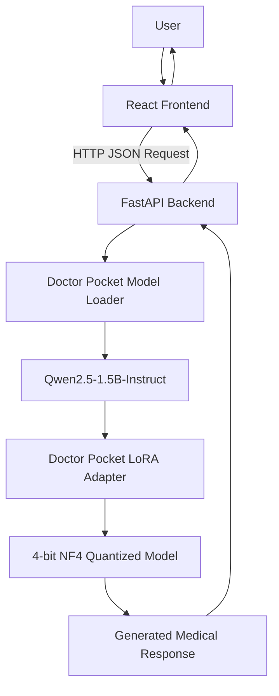
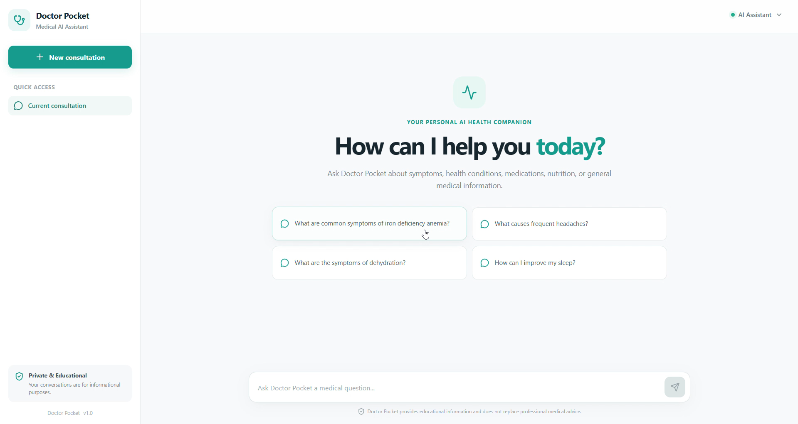
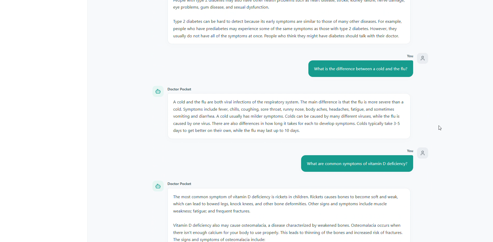
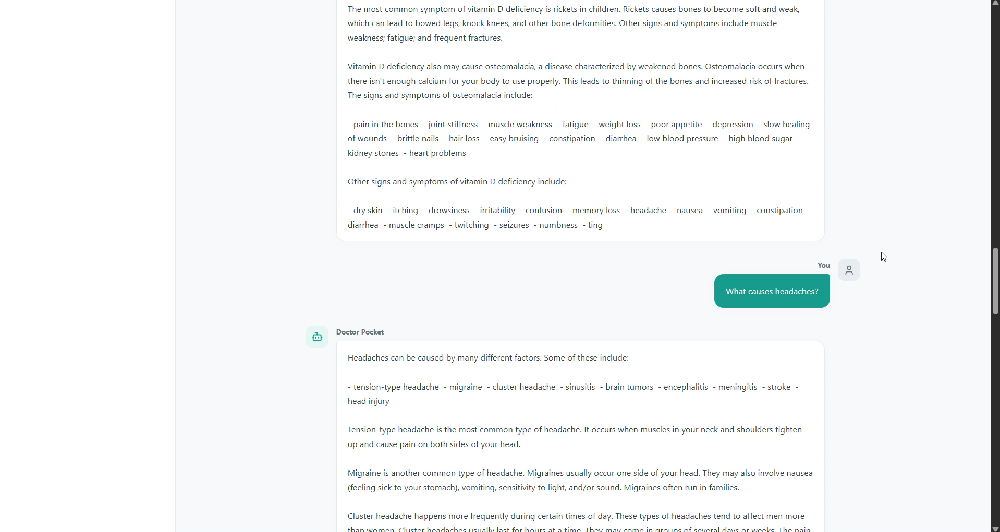
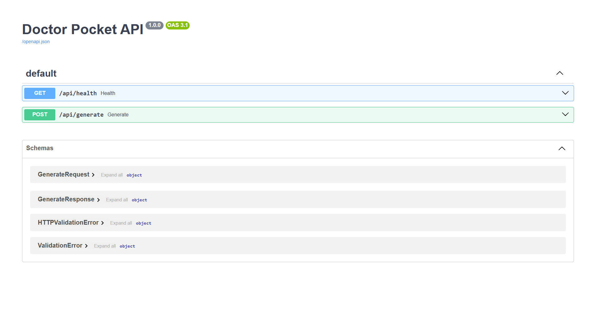
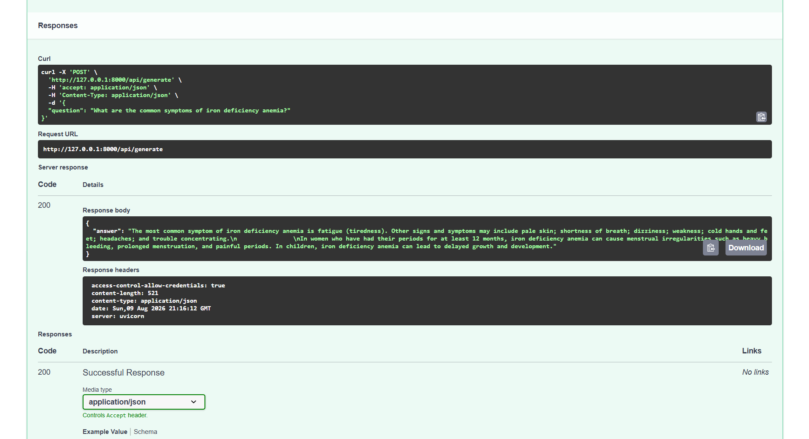

# 🩺 Doctor Pocket

### AI-Powered Medical Question-Answering Assistant

Doctor Pocket is an end-to-end AI medical question-answering application built around a fine-tuned **Qwen2.5-1.5B-Instruct** language model.

The project combines **QLoRA fine-tuning, 4-bit NF4 quantization, PEFT/LoRA, FastAPI, and React** to create a complete AI application that takes medical questions from a web interface and generates educational medical information.

> ⚠️ **Medical Safety Notice**
>
> Doctor Pocket is an educational and research prototype. It is **not a replacement for a qualified physician, medical diagnosis, or professional medical advice**. AI-generated medical information can contain errors. Users experiencing serious symptoms or emergencies should seek professional medical care.

---

## 📌 Project Overview

Doctor Pocket was developed as an end-to-end AI application covering the complete workflow from **medical dataset preparation and LLM fine-tuning to model serving and web deployment**.

The system allows a user to:

1. Open the Doctor Pocket web interface.
2. Enter a medical question.
3. Send the question to the FastAPI backend.
4. Process the question using the fine-tuned Qwen model.
5. Generate an educational medical response.
6. Display the response through the React interface.

The project demonstrates practical experience with:

- Large Language Models
- Instruction Fine-Tuning
- QLoRA
- LoRA / PEFT
- 4-bit Quantization
- Hugging Face Transformers
- PyTorch
- FastAPI
- REST APIs
- React
- Vite
- GPU inference
- Model deployment

---

# 🎯 Project Goal

The goal of Doctor Pocket is to demonstrate how a relatively small instruction-following language model can be adapted to a medical question-answering task using parameter-efficient fine-tuning.

Instead of fully fine-tuning all parameters of the base model, Doctor Pocket uses **QLoRA**, allowing the model to be fine-tuned using significantly less GPU memory.

The final system consists of:

```text
Medical Q&A Dataset
        ↓
Dataset Inspection
        ↓
Random 80/10/10 Split
        ↓
Qwen Chat Template
        ↓
Qwen2.5-1.5B-Instruct
        ↓
4-bit NF4 Quantization
        ↓
QLoRA / LoRA
        ↓
1 Epoch Fine-Tuning
        ↓
Evaluation
        ↓
LoRA Adapter
        ↓
FastAPI Backend
        ↓
React Frontend
```

---

# 🏗️ System Architecture



### Application Flow

```text
User
  │
  ▼
React Frontend
  │
  │ POST /api/generate
  ▼
FastAPI Backend
  │
  ▼
Model Loader
  │
  ├── Qwen2.5-1.5B-Instruct
  │
  └── Doctor Pocket LoRA Adapter
  │
  ▼
Generated Answer
  │
  ▼
React Interface
```

---

# 🧠 Model

## Base Model

```text
Qwen/Qwen2.5-1.5B-Instruct
```

Doctor Pocket uses the instruction-following version of Qwen2.5-1.5B as its base language model.

The model was selected because it provides a relatively compact LLM that can be fine-tuned and deployed using consumer-grade GPU hardware.

---

# ⚡ Fine-Tuning Method

Doctor Pocket uses **QLoRA (Quantized Low-Rank Adaptation)**.

The base model is loaded using:

- 4-bit quantization
- NF4 quantization
- Double quantization
- FP16 computation
- BitsAndBytes

LoRA adapters are then added using PEFT.

Instead of updating the entire base model, the training process updates only the LoRA parameters.

This significantly reduces the number of trainable parameters and GPU memory requirements.

### QLoRA Pipeline

```text
Qwen2.5-1.5B-Instruct
          │
          ▼
    4-bit NF4 Model
          │
          ▼
      LoRA Layers
          │
          ▼
   Parameter-Efficient
      Fine-Tuning
          │
          ▼
 Doctor Pocket Adapter
```

---

# ⚙️ Training Configuration

| Parameter | Configuration |
|---|---|
| Base Model | Qwen/Qwen2.5-1.5B-Instruct |
| Fine-Tuning Method | QLoRA |
| Quantization | 4-bit NF4 |
| Double Quantization | Enabled |
| Compute Precision | FP16 |
| LoRA Rank | 16 |
| LoRA Alpha | 32 |
| LoRA Dropout | 0.05 |
| Epochs | **1** |
| Maximum Sequence Length | 1024 |
| Learning Rate | Approximately 2e-4 |
| Warmup Ratio | Approximately 0.03 |
| Weight Decay | 0.01 |
| Random Seed | 42 |
| Target Training GPU | NVIDIA T4 |
| Batch Size | 2 |
| Gradient Accumulation | 8 |

The effective training batch size was increased through gradient accumulation while keeping the per-device batch size low enough for the available GPU memory.

---

# 🖥️ Hardware

The original training environment was designed around a free Google Colab NVIDIA T4 GPU with approximately 16 GB VRAM.

The resulting model was later tested locally using:

```text
GPU:
NVIDIA GeForce RTX 4050 Laptop GPU

CUDA:
Available
```

The model successfully loaded using 4-bit quantization and the Doctor Pocket LoRA adapter.

---

# 📊 Dataset

The original medical Q&A dataset contained approximately:

```text
13,096 training examples
1,637 validation examples
```

The data was reorganized into a random:

```text
80% Training
10% Validation
10% Testing
```

split using:

```python
seed = 42
```

The final test set was kept separate from training and was used only during the evaluation stage.

---

# 🔀 Dataset Splitting

The project intentionally uses a **random split** rather than preserving the original training/validation grouping.

The final workflow is:

```text
Original Medical Dataset
        │
        ▼
Combine Available Examples
        │
        ▼
Randomized Split
        │
        ├── 80% Train
        ├── 10% Validation
        └── 10% Test
```

The test set is not used during fine-tuning.

---

# 💬 Instruction Formatting

Doctor Pocket uses the official Qwen chat template.

Training examples are formatted conceptually as:

```text
System:
Doctor Pocket medical assistant instructions

User:
[Medical question]

Assistant:
[Medical answer]
```

The tokenizer's official chat template is used instead of manually constructing an incompatible prompt format.

This ensures that training and inference use a consistent conversational structure.

---

# 🛡️ Medical System Prompt

Doctor Pocket uses a safety-oriented system prompt during inference:

```text
You are Doctor Pocket, an AI medical information assistant.
Provide clear, cautious, educational medical information.
Do not claim to replace a doctor.
For emergencies or serious symptoms, advise the user to seek
professional medical care.
Do not invent medical facts.
```

The purpose of this prompt is to encourage cautious educational responses rather than presenting the model as a medical professional.

---

# 📈 Evaluation

The model was manually evaluated using 10 medical questions covering several common medical-information categories.

| # | Topic | Result |
|---|---|---|
| 1 | Dehydration | ✅ Good |
| 2 | High Blood Pressure | ✅ Good |
| 3 | Type 2 Diabetes | ✅ Good |
| 4 | Cold vs. Flu | ✅ Good |
| 5 | Vitamin D Deficiency | ✅ Good |
| 6 | Headaches | ✅ Good |
| 7 | Pneumonia | ✅ Good |
| 8 | Minor Burn | ⚠️ Repetition |
| 9 | Asthma | ✅ Good |
| 10 | Chest Pain / Emergency | ✅ Good |

### Evaluation Observations

The model generally produced relevant educational information across the tested questions.

One notable weakness was **repetition**, particularly for the minor-burn question.

The chest-pain emergency response was acceptable, but the response could be improved further by prioritizing emergency guidance more explicitly.

These tests are qualitative observations and should not be interpreted as evidence of clinical safety or medical accuracy.

Automated language-generation metrics such as BLEU or ROUGE alone are also insufficient for evaluating medical correctness.

A production medical system would require substantially more rigorous evaluation, including medical expert review and dedicated safety testing.

---

# 🧪 Model Testing

Before integrating the model into the web application, the model was tested independently.

The testing process verified:

- CUDA availability
- Qwen base model loading
- 4-bit quantization
- LoRA adapter loading
- Tokenizer loading
- Chat template generation
- Text generation
- GPU inference

The model successfully generated responses to medical questions after loading the saved Doctor Pocket adapter.

---

# 🚀 Backend

The backend is implemented using **FastAPI**.

The backend is responsible for:

- Loading the Qwen base model
- Loading the Doctor Pocket LoRA adapter
- Loading the tokenizer
- Keeping the model loaded in memory
- Using GPU acceleration when available
- Applying the Doctor Pocket system prompt
- Applying the Qwen chat template
- Generating medical responses
- Returning JSON responses to the frontend

The model is loaded once when the application starts rather than being reloaded for every request.

This is important because loading the LLM for every request would introduce significant latency.

---

# 🔌 API Endpoints

## Health Check

```http
GET /api/health
```

Used to verify that the backend is running.

---

## Generate Medical Answer

```http
POST /api/generate
```

Example request:

```json
{
    "question": "What are the symptoms of anemia?"
}
```

Example response:

```json
{
    "answer": "The most common symptom of iron deficiency anemia is fatigue..."
}
```

---

# 🎨 Frontend

The frontend is built using:

- React
- Vite
- JavaScript
- Lucide React

The interface includes:

- Doctor Pocket branding
- Medical chat interface
- Suggested medical questions
- Conversation history
- User and assistant messages
- Loading animation
- Responsive mobile layout
- Sidebar navigation
- New consultation button
- Medical safety disclaimer
- FastAPI integration

---

# 🖥️ Application Screenshots

## Main Interface



## Medical Conversation





## FastAPI API Documentation





> Screenshots demonstrate the local development version of the application.

---

# 🎥 Demo

## Doctor Pocket Demo

A complete demonstration of the Doctor Pocket application is available here:

**[▶️ Watch the Doctor Pocket Demo](YOUR_DEMO_VIDEO_LINK)**

## Chat Demonstration

A separate demonstration showing the medical question-answering interaction is available here:

**[▶️ Watch the Doctor Pocket Chat Demo](YOUR_CHAT_VIDEO_LINK)**

---

# 📁 Project Structure

```text
Doctor-Pocket/
│
├── backend/
│   └── app/
│       ├── api/
│       ├── models/
│       ├── services/
│       └── ...
│
├── frontend/
│   ├── public/
│   ├── src/
│   ├── package.json
│   └── ...
│
├── model/
│   └── README.md
│
├── notebooks/
│   └── Doctor_Pocket_Qwen2.5_1.5B_T4.ipynb
│
├── .gitignore
└── README.md
```

---

# 📓 Training Notebook

The training notebook documents the complete model development pipeline.

It covers:

1. Environment setup
2. Dependency installation
3. GPU verification
4. Dataset loading
5. Dataset inspection
6. Dataset preprocessing
7. Train/validation/test splitting
8. Tokenization
9. Qwen model loading
10. 4-bit NF4 quantization
11. QLoRA configuration
12. Training configuration
13. Fine-tuning
14. Evaluation
15. Model saving
16. Inference testing
17. FastAPI deployment preparation

The notebook is located at:

```text
notebooks/Doctor_Pocket_Qwen2.5_1.5B_T4.ipynb
```

---

# 💾 Model Files

The trained LoRA adapter is intentionally **not included in this GitHub repository** because the model files are large.

The expected local directory is:

```text
model/
└── doctor_pocket_qwen25_1_5b_lora/
```

The directory contains the trained LoRA adapter and tokenizer files.

Typical files include:

```text
adapter_config.json
adapter_model.safetensors
tokenizer.json
tokenizer_config.json
special_tokens_map.json
```

The backend loads:

```text
Qwen/Qwen2.5-1.5B-Instruct
```

and then applies the Doctor Pocket LoRA adapter.

See:

```text
model/README.md
```

for additional information about the model files.

---

# 🛠️ Local Installation

## Requirements

Recommended environment:

```text
Python 3.10+
Node.js LTS
NVIDIA GPU with CUDA support
```

The project can also be adapted for CPU execution, although LLM inference will be significantly slower.

---

# 🐍 Backend Setup

From the project root:

```powershell
cd backend
```

Create the Python virtual environment:

```powershell
python -m venv venv
```

Activate it:

```powershell
venv\Scripts\activate
```

Install the backend dependencies:

```powershell
pip install -r requirements.txt
```

Make sure the trained model adapter exists at:

```text
model/doctor_pocket_qwen25_1_5b_lora/
```

---

# ▶️ Start the Backend

From the project root:

```powershell
python -m uvicorn app.main:app --reload --app-dir backend
```

The backend should start at:

```text
http://127.0.0.1:8000
```

FastAPI Swagger documentation:

```text
http://127.0.0.1:8000/docs
```

You can use the Swagger interface to test the API directly.

---

# ⚛️ Frontend Setup

Open a second terminal.

From the project root:

```powershell
cd frontend
```

Install the JavaScript dependencies:

```powershell
npm install
```

Start the Vite development server:

```powershell
npm run dev
```

The frontend will normally be available at:

```text
http://localhost:5173
```

---

# 🔗 Frontend ↔ Backend Communication

The React frontend communicates with the FastAPI backend using HTTP requests.

The basic architecture is:

```text
React
  │
  │ JSON Request
  ▼
FastAPI
  │
  ▼
Doctor Pocket Model
  │
  ▼
Generated Answer
  │
  ▼
FastAPI
  │
  │ JSON Response
  ▼
React
```

Example:

```json
{
    "question": "What are common symptoms of dehydration?"
}
```

The backend generates the answer and returns it to the React application.

---

# 📦 Dependencies

### Machine Learning

- PyTorch
- Hugging Face Transformers
- Hugging Face Datasets
- PEFT
- TRL
- BitsAndBytes
- Accelerate
- Evaluate
- scikit-learn

### Backend

- FastAPI
- Uvicorn
- Pydantic

### Frontend

- React
- Vite
- Lucide React

---

# 🔐 Security

Sensitive credentials and local environment files are excluded from version control.

The repository ignores:

```text
.env
backend/venv/
frontend/node_modules/
model/doctor_pocket_qwen25_1_5b_lora/
```

No Hugging Face authentication tokens or API keys should be committed to the repository.

---

# 🧹 GitHub Repository Design

Large model weights and generated/local files are intentionally excluded from GitHub.

The repository contains the source code, training notebook, documentation, and deployment structure required to understand and reproduce the project.

The trained LoRA adapter is kept separately because of its file size.

---

# 🔮 Future Improvements

Potential future improvements include:

### Model

- Larger and higher-quality medical datasets
- More training data
- Improved response consistency
- Better reduction of repetitive outputs
- Better hallucination detection
- More comprehensive medical evaluation

### Medical Safety

- Expert medical review
- Dedicated safety benchmarks
- Emergency-response evaluation
- Hallucination testing
- Evidence-based retrieval
- Medical source citation

### Architecture

- Retrieval-Augmented Generation (RAG)
- Medical knowledge base
- Conversation memory
- User authentication
- Database-backed conversation history
- Production GPU deployment

### Frontend

- Conversation persistence
- Chat history
- Better mobile experience
- Markdown medical responses
- Source citations
- Improved accessibility

---

# ⚠️ Medical Safety Disclaimer

Doctor Pocket is an **educational/research prototype**.

It must not be used as a substitute for:

- Professional medical advice
- Medical diagnosis
- Emergency medical services
- Prescription decisions
- Clinical decision-making

The model may produce inaccurate, incomplete, outdated, or inappropriate information.

For emergencies or serious symptoms, users should seek professional medical care immediately.

---

# 👨‍💻 Technologies Used

| Category | Technologies |
|---|---|
| Language | Python, JavaScript |
| LLM | Qwen2.5-1.5B-Instruct |
| Fine-Tuning | QLoRA, LoRA, PEFT |
| Quantization | BitsAndBytes, NF4 |
| Deep Learning | PyTorch |
| LLM Framework | Hugging Face Transformers |
| Training | TRL |
| Backend | FastAPI, Uvicorn |
| Frontend | React, Vite |
| UI Icons | Lucide React |
| Training Hardware | Google Colab NVIDIA T4 |
| Local Testing | NVIDIA RTX 4050 Laptop GPU |
| Version Control | Git, GitHub |

---

# 🎓 Project Summary

Doctor Pocket demonstrates an end-to-end workflow for building and deploying a domain-adapted LLM application:

```text
Medical Dataset
       ↓
Data Preprocessing
       ↓
80/10/10 Random Split
       ↓
Qwen Chat Formatting
       ↓
Qwen2.5-1.5B-Instruct
       ↓
4-bit NF4 Quantization
       ↓
QLoRA Fine-Tuning
       ↓
1 Epoch Training
       ↓
Model Evaluation
       ↓
LoRA Adapter
       ↓
FastAPI
       ↓
React
       ↓
Medical Q&A Application
```

The project demonstrates how an LLM can be adapted to a specific question-answering domain and integrated into a complete software application.

---

## 👤 Author

**Ahmed Samy**

Electronics & Communication Engineering Graduate  
AI / Machine Learning Engineer

---

⭐ If you found this project interesting, feel free to explore the training notebook and implementation.